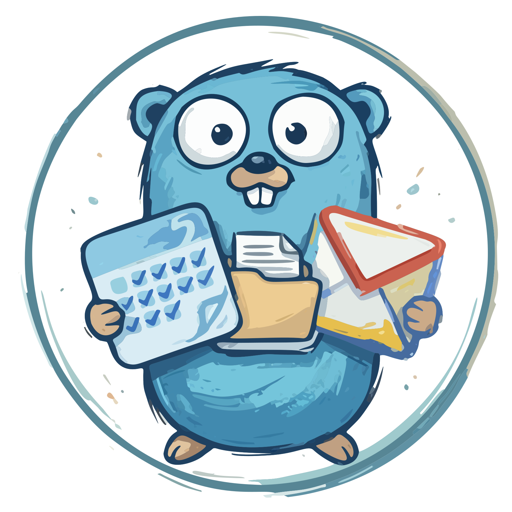

<div align="center">
  
  <h1>gcli</h1>

  <a href="https://github.com/tanq16/gcli/actions/workflows/release.yaml"></a>&nbsp;<a href="https://github.com/tanq16/gcli/releases"></a><br><br>
  <a href="#capabilities">Capabilities</a> &bull; <a href="#installation">Installation</a> &bull; <a href="#usage">Usage</a> &bull; <a href="#tips-and-notes">Tips & Notes</a>
</div>

---

CLI tool for Google Drive, Gmail, and Calendar. Manage files, threads, and events from the terminal.

## Capabilities

| Service | Commands | Description |
|---------|----------|-------------|
| Auth | `login` | OAuth2 authentication with Google services |
| Drive | `list`, `info`, `search` | Browse folder contents, view metadata, search files |
| Drive | `upload`, `download` | Transfer files and folders with progress |
| Drive | `mkdir`, `move`, `copy`, `delete` | File and folder management |
| Drive | `sync push`, `sync pull` | Bidirectional directory sync with concurrency |
| Drive | `permissions list/create/delete` | Manage file sharing permissions |
| Mail | `list`, `get`, `search` | List, view, and search Gmail threads |
| Mail | `send`, `reply`, `forward` | Compose, reply, and forward with attachments and signatures |
| Mail | `mark read/unread/star/unstar/archive/trash/spam` | Thread state management |
| Calendar | `list`, `get`, `calendars` | View events and calendars |
| Calendar | `create`, `edit`, `delete` | Manage calendar events with attendees |

## Installation

### Binary

Download from [releases](https://github.com/tanq16/gcli/releases):

```bash
# Linux/macOS
ARCH=$(uname -m); [ "$ARCH" = "x86_64" ] && ARCH=amd64; [ "$ARCH" = "aarch64" ] && ARCH=arm64
curl -sL https://github.com/tanq16/gcli/releases/latest/download/gcli-$(uname -s | tr '[:upper:]' '[:lower:]')-$ARCH -o gcli
chmod +x gcli
sudo mv gcli /usr/local/bin/
```

### Build from Source

```bash
git clone https://github.com/tanq16/gcli
cd gcli
make build
```

## Usage

### Setup

1. Create OAuth credentials in [Google Cloud Console](https://console.cloud.google.com/apis/credentials)
2. Download the client secret JSON to `~/.config/gcli/credentials.json`
3. Run `gcli login` to authenticate

### Drive

```bash
gcli drive list /Documents
gcli drive info /Documents/report.pdf
gcli drive search "quarterly report" --type file --limit 20

gcli drive upload ./local-file.pdf /Documents/
gcli drive download /Documents/report.pdf ./

gcli drive mkdir /Documents/NewFolder
gcli drive move /Documents/file.pdf /Archive/
gcli drive copy /Documents/file.pdf /Backup/ --name file-copy.pdf
gcli drive delete /Documents/old-file.pdf

gcli drive sync push ./local-dir /Documents/remote-dir --concurrency 8
gcli drive sync pull /Documents/remote-dir ./local-dir

gcli drive permissions list /Documents/shared-file.pdf
gcli drive permissions create /Documents/file.pdf --type user --role reader --email user@example.com
```

### Mail

```bash
gcli mail list                     # Recent inbox threads
gcli mail list 5 --unread          # 5 unread threads
gcli mail list --label SENT        # Sent threads
gcli mail get <thread-id>          # All messages in a thread
gcli mail search "from:user@example.com"

gcli mail send -t recipient@example.com -s "Subject"
gcli mail send -t recipient@example.com -s "Subject" --body-file email.html
gcli mail reply <thread-id>
gcli mail reply <thread-id> --all
gcli mail forward <thread-id> -t other@example.com

gcli mail mark read <thread-id>
gcli mail mark unread <thread-id>
gcli mail mark star <thread-id>
gcli mail mark archive <thread-id>
gcli mail mark trash <thread-id>
```

### Calendar

```bash
gcli cal list                      # Today's events
gcli cal list 7                    # Next 7 days
gcli cal list --all-calendars      # Events from all calendars
gcli cal get <event-id>
gcli cal calendars                 # List all calendars with IDs

gcli cal create "Team standup" --start "tomorrow 9am" --duration 30m
gcli cal create "Launch party" --start "2025-06-01T18:00" --end "2025-06-01T21:00" --location "Office"
gcli cal edit <event-id> --add-attendee user@example.com
gcli cal delete <event-id> --notify
```

## Tips and Notes

- All drive commands accept `--id` flag to use Drive file IDs directly instead of paths
- Use `--debug` for structured log output with full error details
- Use `--for-ai` for plain text output suitable for piping to other tools
- Gmail operates on threads (not individual messages), matching the Gmail UI
- Email signatures are supported via `--signature` flag on send/reply/forward
- Google Workspace files (Docs, Sheets, Slides) are automatically exported on download
- Sync skips Google Workspace native files (no checksum available)
